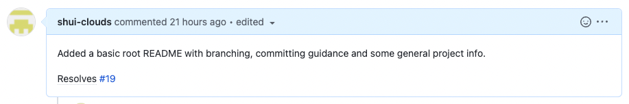

# 🗣️🍔 Chatty Chef 🤔💭🌯
### 🐛 Tasks / Issues
See our Github issues for overview of all features and tasks for the project:

https://github.com/gentleseal/COM3014-CW/issues

Please add any ideas you have or any features you are working on!

### 💼 Kanban / Project Board
See our Github project for a kanban board of all tasks and their status (each task is a Github issue):

https://github.com/gentleseal/COM3014-CW/projects/2

Move your issues so everyone knows how you're doing!

# 📁 Folder Structure
To keep things organised, we have a folder for each service:

[`chatbot`](/chatbot/) for chatbot related things

[`next`](/next/) for any website work

- Go to the [structure section of Next JS](/next/README.md#%EF%B8%8F-structure) to find out how our `next` app is structured.

# 📝 Committing

*(don't forget to follow the [branching strategy in the section below](#🌿-branching))*

Make sure to commit your code regularly with sensible commit messages, ideally following [Conventional Commits](https://www.conventionalcommits.org/en/v1.0.0/) for your messages when you can.

This would usually be `feat:...`, `fix:...`, or `BREAKING CHANGE:...` in your commit messages to communicate what is being committed. 

E.g. `feat: new menu item component`, `fix(basket): discount calculation`, `BREAKING CHANGE: upgraded next.js version`

Try to keep commits relevant e.g. a commit with the message:

`feat: created a component for menu item`

should not contain code for things that aren't related to the menu item, e.g. the menu page.
# 🌿 Branching

For our branching strategy, we have two principle branches:

### `main`
Our production branch which will have CI/CD to auto-deploy the code. 

No direct commits or merges into it are allowed. To make changes to it we merge the current (presumably tested) `dev` branch into it.

### `dev`
This branch is meant to represent the latest state of the code. It may not be completely tested or stable.

Ideally most commits should not be made into `dev` (unless it is a hotfix or a tiny change). 

For most changes, `feature/...`, `fix/...`, `refactor/...` branches would branch off (new branches based on) of `dev` to be worked on and then merged back.

## 🍃 Starting a task
When you want to start a task, create a new branch from `dev`
(make sure to run `git fetch` so you are up-to-date with any recent changes).

We use the branching naming convention of `[type of work]/[task]`. Please try to keep the type of work consistent with below if you can.

Generally this would be: `feature/...`, `fix/...` or `refactor/...`

You can see some examples below:

A branch for developing a **new feature** or **functionality**  : `feature/menu-page`

A branch to **fix** a component / bug / library... : `fix/navbar-size`

A branch to **refactor** the structure / code... : `refactor/folder-structure`

Branch it from dev

**Try to keep the scope of your branch consistent. E.g. A feature you are working on / a bug / group of bugs you are fixing etc. Instead of combining unrelated work, try to keep it obvious to others what your branch / changes do.**

## 🌳 Merging

When you are done and want to merge your work, create a pull request (PR) for merging with `dev`.

### Navigate to PRs (https://github.com/gentleseal/COM3014-CW/pulls)

### Make a PR from your feature branch

### To `dev`

 
 ### Ideally add some reviewers for other people to see and potentially validate your work.

### Also don't forget to add some tags

### and include the PR in our Github project 

### (as well as mentioning any issues / tasks this PR closes, if you mention it in the description it should link to our board automatically 🤯)

### You can go ahead and merge once you are happy or have gotten the reviews you wanted.

